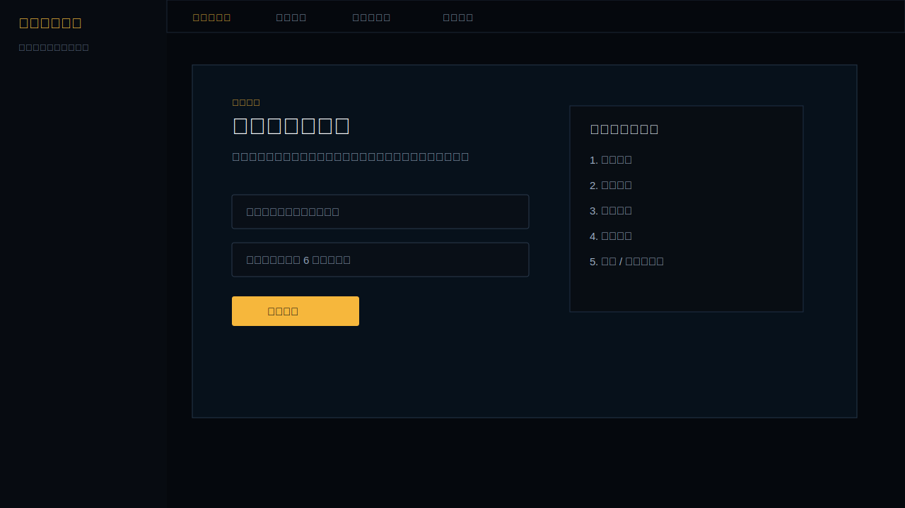
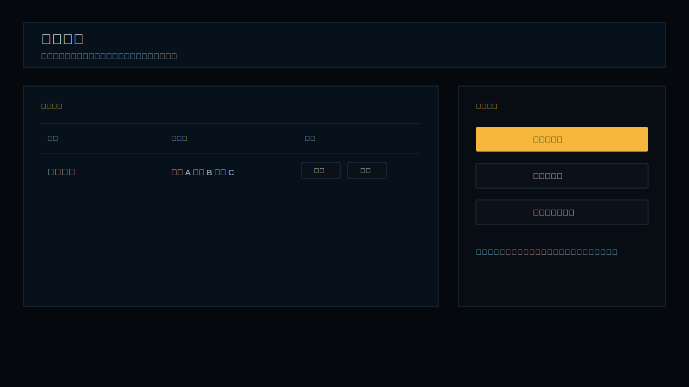
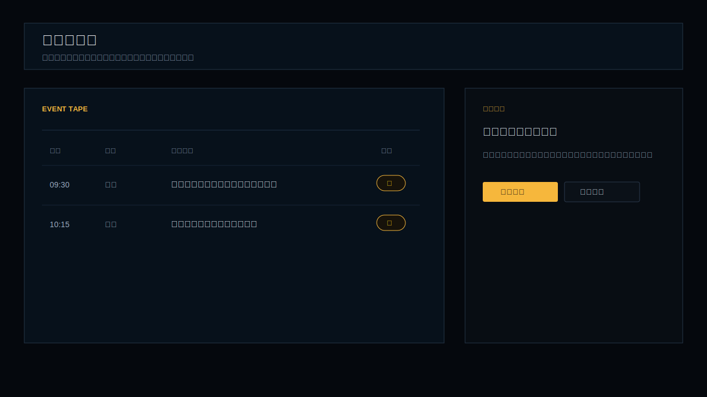
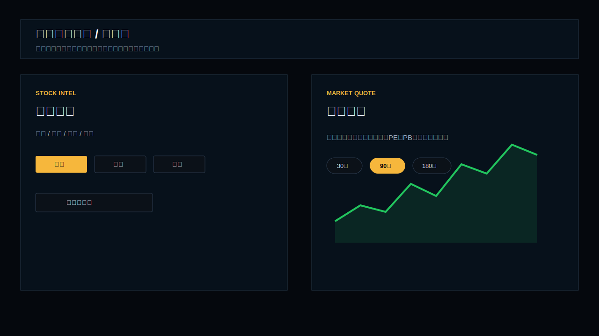
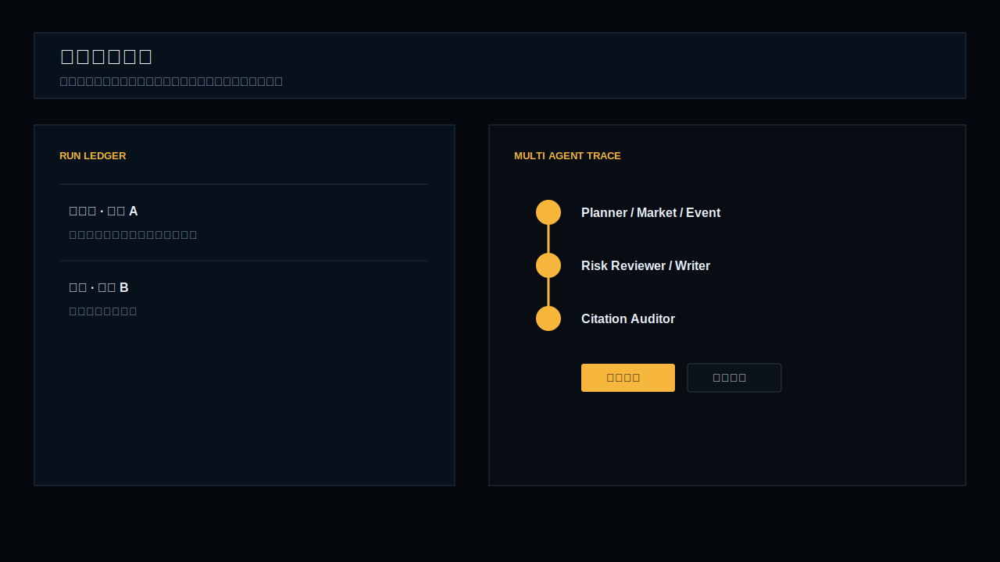

# 金融研究终端使用说明

本文说明如何从一个空账号开始使用平台，完成“创建组合 → 刷新事件 → 处理预警 → 查看行情 → 生成研报 → 预览交付”的完整流程。

> 当前账号 `Tches` 的业务数据已清零。用户本身没有删除，仍可继续登录。清理前数据已归档到 `output/reset_backups/20260518_172023/`。

## 1. 登录后进入空工作区

打开前端地址：

- 本地前端：`http://localhost:3004`
- 本地 API：`http://127.0.0.1:8000`

新账号或清零后的账号会进入空工作区，只显示“创建第一个组合”，不会自动加载演示数据或历史股票。



## 2. 创建组合

在首页或“组合监控”页面创建组合：

1. 输入组合名称，例如“核心持仓”。
2. 在股票输入框中输入股票名称或 6 位代码。
3. 从搜索候选中选择股票，也可以直接粘贴多个股票代码。
4. 点击“创建组合”。

创建成功后，平台会进入该组合的风险驾驶舱。只有你创建的组合会沉淀事件、预警和研报任务。



## 3. 刷新组合事件

进入组合详情后，点击“刷新组合”。

刷新会执行：

- 拉取组合股票的公告、行情异动、研报观点等公开信息。
- 抽取结构化事件。
- 做语义去重、影响等级评估和预警规则命中。
- 将结果写入当前账号的数据空间。

刷新前，事件台和预警台应为空；刷新后才会出现事件流和预警队列。

## 4. 处理事件与预警

进入“事件预警台”后，可在 `事件 / 预警` 之间切换。

常用操作：

- 点击事件行：定位当前事件。
- 点击“查看详情”：进入新闻式事件详情页。
- 点击“处理”：对预警进行复核、忽略或转为研报任务。
- 点击“生成点评”：基于当前事件生成事件点评任务。



事件详情页会集中展示：

- 事件标题与正文摘要。
- 来源证据和原文链接。
- 影响方向、影响等级、置信度。
- 关联股票与处理动作。
- 行情快照类事件会附带行情信息入口。

## 5. 查看单股情报与行情

从事件、组合股票池或顶部搜索进入单股情报中心。

单股情报中心主要包括：

- `概览`：股票当前研究状态和最近信号。
- `事件`：该股票相关事件时间线。
- `回测`：事件后收益、回撤和正收益占比。
- `交付`：该股票相关报告、点评和导出物。

点击“行情”可进入独立行情页，查看最新价、涨跌幅、成交额、PE、PB、市值和日线走势。



## 6. 生成研报任务

可以从以下入口生成研报：

- 首页右侧“生成研报”。
- 单股情报中心的操作入口。
- 事件详情页的“生成事件点评”。
- 任务交付中心的新建任务入口。

研报任务会进入任务交付中心。平台使用多智能体链路进行研究组织，包括计划、行情分析、事件分析、风险复核、报告写作和引用审计。



## 7. 查看报告交付物

任务完成后，进入任务详情页或单股情报中心的“交付”页。

导出物通常包括：

- `.html`：网页报告，推荐点击“预览”。
- `.md`：Markdown 报告，可预览或下载。
- `.json`：来源与结构化数据。
- `.log`：执行轨迹。

注意：

- “预览”会在浏览器中直接打开报告。
- “下载”会保存文件到本地。
- 如果看不到报告，先确认任务状态为“已完成”，再到“交付”页查看导出物。

## 8. 质量指标页

“质量指标”是内部展示页，用于查看项目工程和评测信息，例如：

- 自动化测试覆盖情况。
- 事件处理评测。
- RAG 引用可信度指标。
- 多智能体任务执行指标。
- 多用户隔离冒烟结果。

该页面适合用于项目展示和简历指标说明。

## 9. 当前账号清零说明

本次已对当前账号执行清零：

- 清空组合与股票池。
- 清空市场事件。
- 清空追踪预警。
- 清空研报任务和任务流水。
- 清空导出物记录。
- 清空研究历史与记忆快照。
- 将当前账号导出文件移入备份目录。

未删除：

- 用户账号。
- 其他用户的数据。
- 全局 benchmark、缓存和项目文档。

备份目录：

```text
output/reset_backups/20260518_172023/
```

恢复时需要先停止 API，再将该目录下的数据库和用户文件恢复到 `output/`。通常只建议在本地开发环境恢复，线上环境应先做完整备份。

## 10. 推荐使用路径

首次使用建议按以下顺序：

1. 创建第一个组合。
2. 添加 2 到 5 只股票。
3. 手动刷新组合。
4. 进入事件预警台处理高优先级预警。
5. 进入单股情报中心查看事件和行情。
6. 生成一份研报任务。
7. 在任务交付中心查看多智能体链路。
8. 在交付页预览或下载报告。

